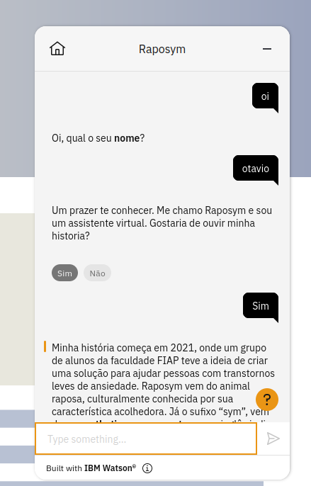
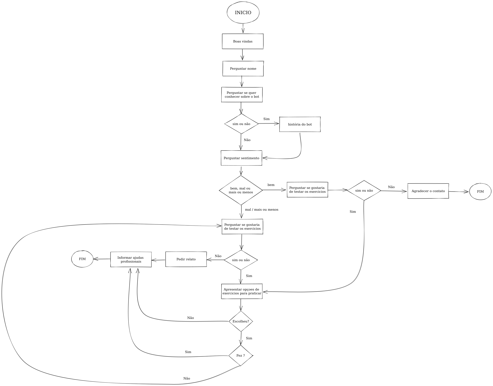
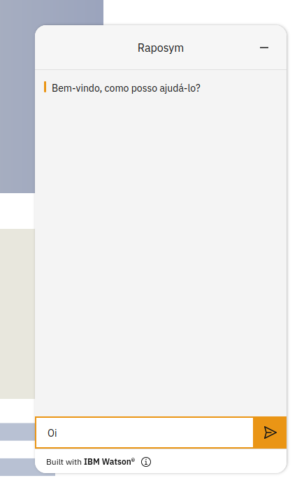

# Raposym - Challenge Sprint 3 

  

# Sobre
O projeto foi criado com o Watson Assistant, então caso queira acessar o código, estou disponibilizando o JSON file para importar a solução no ambiente da IBM.

 

# Grupo - Syminate

88008 - Anderson Rodrigues Dias

87075 - Otávio Santos do Carmo

88150 - Henrique Benicio Campos Silva

87142 - Gustavo Diaz Gonzalez

86415 - HELLEN CRISTINA PEREIRA BRITO

86780 - William de Souza Carvalho Bozzato

 

# Fluxo conversacional

  

 

# Como acessar o chatbot

### Acesse o live preview

    https://web-chat.global.assistant.watson.appdomain.cloud/preview.html?region=us-south&integrationID=0f9ae6a5-d8ea-469d-9a4f-040ee5dbfcf1&serviceInstanceID=f499be27-9cb9-474a-b4b2-2a67d6045077

### Clique no botão indicado

 

  

 

### Digite uma saudação (exemplo: "oi", "ola").

 

  

     

# Link do video

    https://www.youtube.com/watch?v=iTXXRW7qWfQ
